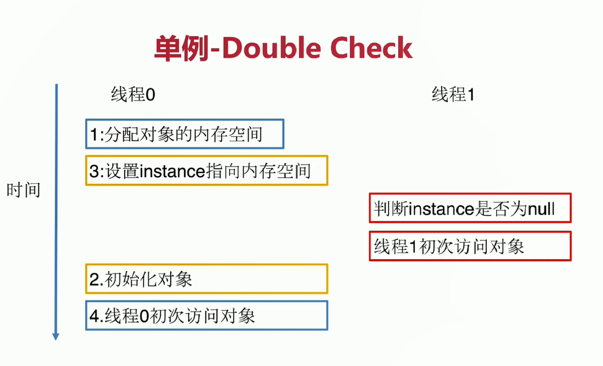

# DesignCoding 设计模式
## 一、软件设计七大原则 
#### 1.1开闭原则    
	定义：一个软件实体如类、模块和函数应该对扩展开放，对修改关闭。    
	定义补充：用抽象构建框架，用实现扩展细节    
	优点：提高软件系统的可复用性以及维护性
#### 1.2里氏替换原则    
	定义：任何父类可以出现的地方，子类一定可以出现。    
	定义补充：里氏代换原则是对“开-闭”原则的补充。    
	引申意义：子类可以扩展父类的功能，但不能改变父类原有的功能。    
	    含义1：子类可以实现父类的抽象方法，但不能覆盖父类的非抽象方法。    
	    含义2：子类中可以增加自己特有的方法。    
	    含义3：当子类的方法重载父类的方法时，方法的前置条件(即方法的输入/入参)要比父类方法的输入参数更宽松。    
	    含义4：当子类的方法实现父类的方法时(重写/重载或实现抽象方法)方法的后置条件(即方法的输出/返回值)要比父类更严格或相等。    
	优点：    
		• 约束继承泛滥，开闭原则的一种体现。    
		• 加强程序的健壮性，同时变更时也可以做到非常好的兼容性、提高程序的维护性、扩展性。降低需求变更时引入的风险。 
#### 1.3依赖倒置原则    
	定义：高层模块不应该依赖低层模块，二者都应该依赖其抽象    
	定义补充：
		•抽象不应该依赖细节，细节应该依赖抽象    
		•针对接口编程，不要针对实现编程    
	优点：
		•可以减少类间的耦合性、提高系统稳定性，提高代码可读性和可维护性，可降低修改程序所造成的风险
#### 1.4单一职责原则    
	定义：不要存在多于一个导致类变更的原因    
	定义补充：一个类/接口/方法只负责一项职责    
	优点：
		降低类的复杂度、提高类的可读性，提高系统的可维护性、降低变更引起的风险 
#### 1.5接口隔离原则    
	定义：用多个专门的接口，而不使用单一的总接口，客户端不应该依赖它不需要的接口    
	定义补充：    
		• 一个类对一个类的依赖应该建立在最小的接口上    
		• 建立单一接口，不要建立庞大臃肿的接口    
		• 尽量细化接口，接口中的方法尽量少    
		• 注意适度原则，一定要适度    
	优点：
		•符合我们常说的高内聚低耦合的设计思想，从而使的类具有很好的可读性、可扩展性和可维护性。    
	接口隔离原则与单一职责异同：    
		•接口隔离原则约束的接口依赖的隔离。针对的是抽象。    
		•单一职责原则约束的是类/接口/方法的职责是单一的，强调的是职责。针对的是程序中的实现和细节 
#### 1.6迪米特原则    
	定义：一个对象应该对其他对象保持最少的了解，使得系统功能模块相对独立，这样当一个模块修改时，影响的模块就会	越	少，扩展起来更加容易。又叫最少知道原则    
	定义补充：
		•尽量降低类与类之间的耦合    
	优点：
		•降低类之间的耦合    
		•强调只和朋友交流，不和陌生人说话    
	朋友：出现在成员变量、方法的输入、输出参数中的类称为成员朋友类，而出现在方法体内部的类不属于朋
#### 1.7合成复用原则    
	定义：尽量首先使用合成/聚合的方式，而不是使用继承。    
	优点：可以使系统更加灵活，降低类与类之间的藕合度一个类的变化对其他类造成的影响相对较少 
## 二、23种设计模式 
#### 2.1简单工厂    
	定义：有一个工厂对象决定创建出哪一种产品类的实例    
	类型：创建型，但不属于GO23种设计模式    
	视用场景：
		•工厂类负责创建的对象比较少    
		•客户端（应用层）只知道传入的工厂类的参数，对于如何创建对象（逻辑）不关心    
	优点：只需要传入一个正确的参数，就可以获取所需的对象，无须知道其创建细节    
	缺点：职责相对过重，增加新的产品，需要修改工厂类的判断逻辑，违背开闭原则    
	实际应用：LoggerFactory 
#### 2.2工厂方法模式    
	定义：定义一个创建对象的接口，但让实现这个接口的类来决定实例化哪个类    
	    工厂方法让类的实例化推迟到子类中进行    
	类型：创建型    
	适用场景：
		•创建对象需要大量重复代码    
		•客户端（应用层）不依赖产品类实例如何被创建、实现等细节    
		•一个类通过其子类来指定创建哪个对象    
	优点：
		•用户只需要关心所需产品对应的工厂，无须关心创建细节    
		•加入新产品符合开闭原则，提高可扩展性    
	缺点：
		•类的个数容易过多，增加复杂度    
		•增加了系统的抽象性和理解难度    
	实际应用：Collection类、URLStreamHandlerFactory类 
#### 2.3抽象工厂模式    
	定义：抽象工厂模式提供一个创建一系列相关或相互依赖对象的接口    
	    无须指定他们具体的类    
	类型：创建型    
	适用场景：
		•客户端（应用层）不依赖于产品类实例如何被创建、实现等细节    
	    •强调一系列相关的产品对象（属于同一产品族）一起使用创建对象需要大量重复的代码    
	    •提供一个产品类的库，所有的产品以同样的接口出现，从而使客户端不依赖于具体实现    
	优点：
		•具体产品在应用层代码隔离，无须关心创建细节    
	    •将一个系列的产品族统一到一起创建    
	缺点：
		•规定了所有可能被创建的产品集合，产品族中扩展新的产品困难，需要修改抽象工厂的接口    
	    •增加了系统的抽象和理解难度    
	实际应用：java.sql.Connection
#### 2.4建造者模式  
	定义：将一个复杂对象的创建与它的表示分离，使得同样的 创建过程可以创建不同的表示    
	用户只需要指定需要建造的类型就可以得到他们，建造过程及细节不需要知道    
	类型：创建型    
	适用场景：
		•如果一个对象有非常复杂的内部结构（很多属性）    
	    •想把复杂对象的创建和使用分离    
	优点：
		•封装性好，创建和使用分离    
	    •扩展性好、建造类之间独立、一定程度上解耦    
	缺点：
		•产生多余的Builder对象    
	    •产品内部发生变化，建造者都需要修改，成本较大    
	实际应用：StringBuilder类、StringBuffer类、ImmutableSet类、BeanDefinitionBuilder类、SQLSessionFactoryBuilder类 
#### 2.5单例模式    
	定义：保证一个类仅有一个实例，并提供一个全局访问点    
	类型：创建型    
	适用场景：
		•想确保任何情况下都绝对只有一个实例   
		例：网站计数器、数据库连接池    
	优点：
		•在内存里只有一个实例，减少了内存开销    
		•可以避免对资源的多重占用    
		•设置全局访问点，严格控制访问    
	缺点：
		•没有接口，扩展困难    
	重点：
		•私有构造器    
		•线程安全    
		•延迟加载    
		•序列化和反序列化安全    
		•反射    
	volatile:保证内存可见性,禁止指令重排序
		1）保证了不同线程对变量进行操作时的可见性，即一个线程修改了某个变量的值，这新值对其他线程来说是立即可见的。
		2）禁止进行指令重排序。
	备注：
		"懒汉"单例模式无法禁止反射攻击，"饿汉"单例模式可以禁止反射攻击，原因在于对象加载顺序不同，"饿汉"是在类初始化时加载，"懒汉"是在调用时加载。  
	实际应用：
		容器单例
		ThreadLocal线程单例
		RunTime类（饿汉式）、DeskTop（容器单例）、Spring，AbstractFactoryBean，ErrorContext（限制区域不同）、Mybatis

#### 2.6原型模式
	定义：指原型实例指定创建对象的种类，并通过拷贝这些原型对象创建新的对象
		不需要知道任何创建的细节，不调用构造函数
	类型：创建型
	适用场景：
		•类初始化消耗较多资源
		•new产生的一个对象需要非常繁琐的过程（数据准备、访问权限等）
		•构造函数比较复杂
		•循环体中产生大量对象时
	优点：
		•使用原型模式性能比直接new一个对象性能高
		•简化创建过程
	缺点:
		•必须配备克隆方法
		•对克隆复杂对象或克隆出的对象进行复杂改造时，容易引入风险
		•深拷贝、浅拷贝要运用得当
	扩展：
		•申客隆
		•浅克隆
	备注：
		原型模式克隆破坏单例，检查对象是否和预期是否一致
	实际应用：
		实现Cloneable接口的类
		